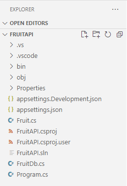
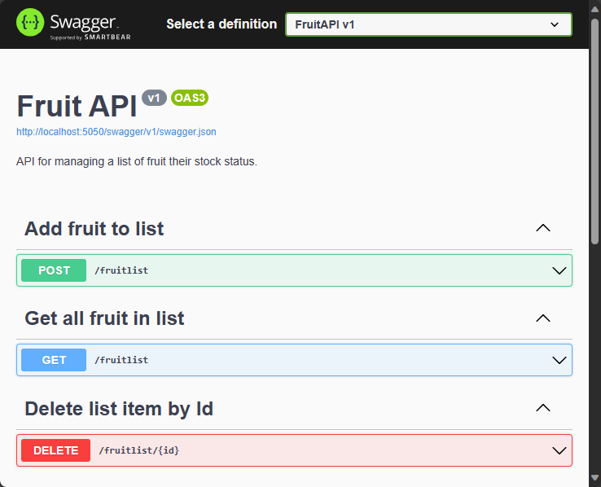
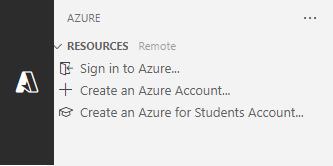
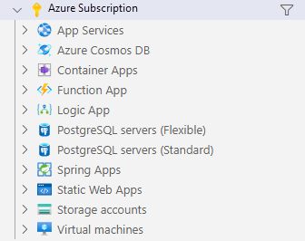

---
lab:
    title: 'Exercise: Interact with an ASP.NET Core minimal API'
    module: 'Module: Interact with an ASP.NET Core minimal API'
---

In this exercise, you run an ASP.NET Core minimal API locally and explore the API and the underlying code. You also publish the API to Azure App Service. 

After you complete this exercise, you'll be able to:

* Navigate a documented API
* Determine endpoints for HTTP operations
* Identify API requirements for HTTP operations
* Publish an app to Azure App Service

## Prerequisites

To complete the exercise you need to have the following installed on your system:

* [Visual Studio Code](https://code.visualstudio.com)
* [The latest .NET 8.0 SDK](https://dotnet.microsoft.com/download/dotnet/8.0)
* [The C# extension](https://marketplace.visualstudio.com/items?itemName=ms-dotnettools.csharp) for Visual Studio Code
* The [Azure Resources](https://marketplace.visualstudio.com/items?itemName=ms-azuretools.vscode-azureresourcegroups) extension for Visual Studio Code.
* [The Azure App Service](https://marketplace.visualstudio.com/items?itemName=ms-azuretools.vscode-azureappservice) extension for Visual Studio Code.
* An Azure account with an active subscription. If you don't already have one, you can sign up for a free trial at [https://azure.com/free](https://azure.com/free).

**Estimated exercise completion time**: 30 minutes

## API information

The API interacts with an in-memory database that contains the following fields:

Field | Type | Description
--- | --- | ---
`id` | integer | Key for the data
`name` | string | Name of the fruit
`instock` | boolean | Indicates if the fruit is instock

The Swagger documentation was created by using the Swashbuckle package.

>**Note:** Sample data is created every time the API is started.


## Download and run the Fruit API code

In this section you:

* Download the API code
* Run the API locally
* Open the API documentation in a browser

### Task 1: Download the API code

1. Right-click the following link and select the **Save link as** option. 

    * [FruitAPI project code](https://raw.githubusercontent.com/MicrosoftLearning/APL-2002-develop-aspnet-core-consumes-api/master/Allfiles/Downloads/FruitAPI.zip) code

1. Launch **File Explorer** and navigate to the location the file was saved.

1. Unzip the file into it's own folder.

#### Task 2: Run the API locally

1. Launch Visual Studio Code and select **File** and then **Open Folder...** in the menu bar.

1. Navigate to the location where you unzipped the project files and select the *FruitAPI* folder.

1. The project structure in the **Explorer** pane should be similar the following screenshot. If the **Explorer** pane isn't visible, select **View** then select **Explorer** in the menu bar.

    

1. Open a Terminal in VS Code by selecting **Terminal** and then **New Terminal**, or use the keyboard shortcut **Ctrl+Shift+`**.

1. In the **Terminal** pane run the following `dotnet` command:

    ```
    dotnet run
    ```

1. Following is an example of the output you'll see in the **Terminal** pane. Note the `Now listening on: http://localhost:5050` line in the output. It identifies the host and port for the API.

    ```
    info: Microsoft.EntityFrameworkCore.Update[30100]
          Saved 3 entities to in-memory store.
    info: Microsoft.Hosting.Lifetime[14]
          Now listening on: http://localhost:5050
    info: Microsoft.Hosting.Lifetime[0]
          Application started. Press Ctrl+C to shut down.
    info: Microsoft.Hosting.Lifetime[0]
          Hosting environment: Development
    info: Microsoft.Hosting.Lifetime[0]
          Content root path: 
          <project location>
    ```

### Task 3: Open the API documentation in a browser

1. To view the API you can either enter `http://localhost:5050` the address bar, or you can **Ctrl+Click** on the `Now listening on: http://localhost:5050` link in the **Terminal** shown previously. The page will display a "This localhost page can't be found" message.

1. Append the URL in the browser with `/swagger`. The `/swagger` endpoint is typically where you will find the documentation for a  Swagger API. The full URL for Swagger documentation is `http://localhost:5050/swagger`. Your browser should now display a web page similar to the following screenshot:

    

## Perform operations in the API

In this section you:

* Perform several operations on the sample data
* Identify endpoint and data requirements for operations

### Task 1: Perform a `GET` operation

1. Expand the **GET** operation with the **Get all fruits** descriptor by clicking anywhere in the **GET** operation box.

1. Explore the sections of the operation and note the information shown in the following table.

    | Section | Description |
    |---|--|
    | **Endpoint** | Shown in the header of the operation. The endpoint is shown as `/fruits`. The full URI is the base URL for the API appended with the specified endpoint, `http://localhost:5050/fruits` in our example. |
    | **Parameters** | None required for this operation. |
    | **Media type** | Specifies the media type encoding the operation will return. |
    | **Example Value** | Displays the schema of the data returned by the operation. Note that this operation returns a JSON array. |

1. Run the operation by selecting the **Try it out** button and then selecting **Execute**.

1. The **Responses** section of the operation has been updated with new information. Note the following:

    * **Request URL:** The URL accessed in the operation.
    * **Server response:**  Shows the success code from the operation and the  **Response body** displays the three sample records.

### Task 2: Perform a `POST` operation

1. Expand the **POST** operation with the **Create a new fruit** descriptor by clicking anywhere in the **POST** operation box.

1. Explore the sections of the operation and note the information shown in the following table.

    | Section | Description |
    |---|--|
    | **Endpoint** | The endpoint is shown as `/fruits`. The full URI is the base URL for the API appended with the specified endpoint, `http://localhost:5050/fruits` in our example. |
    | **Parameters** | None required for this operation. |
    | **Request body** | The **Request body** is required since the API is expecting data to add to the list and it is expecting the media type `application/json`. |
    | **Example Value** | Displays the schema of the data the API is expecting to receive. |  

1. To run the operation select the **Try it out** button. 

1. Replace the JSON in the input box under the **Request body** section with the following:

    ```json
    {
        "id": 0,
        "name": "Pear",
        "instock": true
    }
    ```

    >**Note:** The database will assign it's own index value when adding data so there just needs to be a value in the `id` field.

1. The **Responses** section of the operation has been updated with new information. Note the following:

    * **Request URL:** The URL accessed in the operation.
    * **Server response:**  Shows the success code from the operation and the **Response body** displays the record added to the database.

1. Run the `GET` command in the **Get all fruits** section and note that a record for *Pear* is now included.

### Task 3: Perform a `DELETE` operation

1. Expand the **DELETE** operation with the **Delete a fruit by Id** descriptor by clicking anywhere in the **DELETE** operation box.

1. Explore the sections of the operation and note the information shown in the following table.

    | Section | Description |
    |---|--|
    | **Endpoint** | The endpoint is shown as `/fruits/{id}`. The full URI is the base URL for the API appended with the specified `id` for deletion. For example, `http://localhost:5050/fruits/1` points to the record where `id` equals `1`.
    | **Parameters** | Requires the `id` of the record to be passed in the request URL. |

1. To run the operation select the **Try it out** button. 

1. Delete the `Apple` record in the sample data by entering a `1` in the `id` field in the **Parameters** section and then selecting **Execute**.

1. The **Responses** section of the operation has been updated with new information. Note the following:

    * **Request URL:** The URL accessed in the operation.
    * **Response body:** Displays the deleted record.
    * **Code:**  Shows the success code from the operation.

1. Run the `GET` command in the **Get all fruits** section and note that the record for *Apple* is now deleted.

When you are ready to move to the next section of the exercise:

* Close the browser and stop the Fruit API by entering  **Ctrl + C** in the terminal it's running in.

## Publish the API to Azure App Service

In this section you:

* Use the Azure Resources extension to connect to Azure
* Use the Azure App Service extension to publish the API to App Service

### Task 1: Sign in to Azure

1. Select the Azure Resources extension to open the panel.

    

1. Select **Sign in to Azure...**

    A browser window will open prompting you to sign in to your Azure account. You can close this window after the sign in process is completed. 

1. After the sign in is complete the extension will display a list of available subscriptions in your account. An example is shown in the following screenshot.

    

### Task 2: Create a new web app

1. Select **Ctrl + Shift + P** to open the command palette and type **Create new web app** to filter the list and select the **Azure App Service: Create New Web App... (advanced)** option. 

1. If your account has multiple subscriptions you will be prompted to select the subscription you want to use for the deployment. 

1. Enter a globally unique name for the new web app. You can try `fruitapi-<name>` and replace `<name>` with your name or initials.

1. Select **+Create new resource group** and accept the default value or enter `fruitapi-rg`.

1. Select **.NET 8 (LTS)** for the runtime stack.

1. Select **Linux** for the operating system

1. Select a location for the new resources that is near you.

1. Select **Create a new App Service plan** and accept the default value or enter another name. 

1. Select **Free (F1) Try out Azure at no cost** for the pricing tier.

1. Select **Skip for now** when prompted for a new Application Insights resource.

The tool will create the necessary resources in Azure and compile the code.

### Task 3: Deploy the web app and browse the running site

1. After the resources are create and the code has completed compiling a window will pop-up prompting you to **Deploy**, select the **Deploy** option. 

    The system will build a release version of the code and deploy it to the resources you created earlier.

1. When the deployment has completed a new pop-up will appear with the option to **Browse Website**, select **Browse Website**.

1. In the browser window that opens you may need to add `/fruits` to the end of the URL. You will see the raw output from the API showing all of the data.

    >**NOTE:** The Swagger UI is disabled because it is only enabled for development environments. Deploying to App Service is considered a non-dev environment unless you perform additional configuration.

Congratulations, you have successfully deployed the API to Azure App Service.

>**Note:** It's a good practice to delete resources from Azure that you no longer need. You can remove all of the resources created in this section of the exercise by deleting the resource group created earlier in the Azure portal.

## Review

In this exercise you learned how to:

* Navigate a documented API
* Determine endpoints for HTTP operations
* Identify API requirements for HTTP operations
* Publish an app to Azure App Service 
