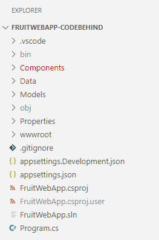

---
lab:
    title: 'Exercise: Implement HTTP operations in ASP.NET Core Razor Pages'
    module: 'Module: Implement HTTP operations in ASP.NET Core Razor Pages'
---

In this exercise, you learn how to add code to an ASP.NET Core Razor Pages app to create the HTTP client and perform `GET`, `POST`, `PUT`, and `DELETE` operations. This code is added to the *.cshtml.cs* code-behind files. The code to render the data in the *.cshtml* files is complete.

## Objectives

After you complete this exercise, you will be able to:

* Implement `IHttpClientFactory` as the HTTP client
* Implement HTTP operations in ASP.NET Core Razor Pages

## Prerequisites

To complete the exercise you need to have the following installed on your system:

* [Visual Studio Code](https://www.visualstudio.com/downloads).
* [The latest .NET 7.0 SDK](https://dotnet.microsoft.com/download/dotnet/7.0).
* [The C# extension](https://marketplace.visualstudio.com/items?itemName=ms-dotnettools.csharp) for Visual Studio Code

**Estimated exercise completion time**: 45 minutes

## Exercise scenario

In this exercise has two components:

* An app that sends HTTP requests to an API. The app runs on `http://localhost:5010`
* An API that responds to HTTP requests. The API runs on `http://localhost:5050`


## Download the code

In this section you download the code for the Fruit web app and the Fruit API. You also run the Fruit API locally so it is available for the web app.

### Task 1: Download and run the API code

1. Right-click the following link and select the **Save link as** option. 

    * [FruitAPI project code](https://github.com/MicrosoftLearning/APL-2002-develop-aspnet-core-consumes-api/blob/development/Allfiles/Downloads/FruitAPI.zip) code

1. Launch **File Explorer** and navigate to the location the file was saved.

1. Unzip the file into it's own folder.

1. Open **Windows Terminal**, or a **Command Prompt**, and navigate to the location you extracted the code for the API.

1. In **Windows Terminal** pane run the following `dotnet` command:

    ```
    dotnet run
    ```

1. Following is an example of the generated output. Note the `Now listening on: http://localhost:5050` line in the output. It identifies the host and port for the API.

    ```
    info: Microsoft.EntityFrameworkCore.Update[30100]
          Saved 3 entities to in-memory store.
    info: Microsoft.Hosting.Lifetime[14]
          Now listening on: http://localhost:5050
    info: Microsoft.Hosting.Lifetime[0]
          Application started. Press Ctrl+C to shut down.
    info: Microsoft.Hosting.Lifetime[0]
          Hosting environment: Development
    info: Microsoft.Hosting.Lifetime[0]
          Content root path: 
          <project location>
    ```

### Task 2: Download and open web app project

1. Right-click the following link and select the **Save link as** option. 

    * [Fruit web app project code](https://github.com/MicrosoftLearning/APL-2002-develop-aspnet-core-consumes-api/blob/development/Allfiles/Downloads/FruitWebApp-CodeBehind.zip) code

1. Launch **File Explorer** and navigate to the location the file was saved.

1. Unzip the file into it's own folder.

1. Open **Windows Terminal**, or a **Command Prompt**, and navigate to the location you extracted the code for the API.

1. Run the following command to start Visual Studio Code and open the project.

    ```
    code .
    ```

1. The project structure in the **Explorer** pane should be similar the following screenshot. If the **Explorer** pane isn't visible, select **View** then select **Explorer** in the menu bar.

    

>**Note:** Take time to review the code in each of the files being edited throughout this exercise. The code is heavily commented and can help you understand the code base.

## Implement code for the HTTP client and `GET` operation

The Fruit web app displays the API sample data on the home page. You need to add code to implement both the HTTP client and `GET` operation so the web app will have data to display on the home page when you first build and run it.

### Task 1: Implement the HTTP client

1. Select the *Program.cs* file in the  **Explorer** pane to open it for editing.

1. Add the following code between the `// Begin HTTP client code` and `// End of HTTP client code` comments.

    ```csharp
    // Add IHttpClientFactory to the container and set the name of the factory
    // to "FruitAPI". The base address for API requests is also set.
    builder.Services.AddHttpClient("FruitAPI", httpClient =>
    {
        httpClient.BaseAddress = new Uri("http://localhost:5050/fruitlist/");
    });
    ```

1. Save the changes to *Program.cs*.

### Task 2: Implement the `GET` operation

1. Select the *index.cshtml.cs* file in the  **Explorer** pane to open it for editing.

1. Add the following code between the `// Begin GET operation code` and `// End GET operation code` comments.

    ```csharp
    // OnGet() is async since HTTP requests should be performed async
      public async Task OnGet()
      {
          // Create the HTTP client using the FruitAPI named factory
          var httpClient = _httpClientFactory.CreateClient("FruitAPI");

          // Perform the GET request and store the response. The empty parameter
          // in GetAsync doesn't modify the base address set in the client factory 
          using HttpResponseMessage response = await httpClient.GetAsync("");

          // If the request is successful deserialize the results into the data model
          if (response.IsSuccessStatusCode)
          {
              using var contentStream = await response.Content.ReadAsStreamAsync();
              FruitModels = await JsonSerializer.DeserializeAsync<IEnumerable<FruitModel>>(contentStream);
          }
      }
    ```

1. Save the changes to *Program.cs*.

1. Review the code in the *Program.cs* file. Note where the `IHttpClientFactory` is added to the page with dependency injection. Also note that the data model is bound to the page by using the `[BindProperty]` attribute.

### Task 3: Run the web app

1. In the VS Code top menu select **Run | Start debugging**, or select **F5**. After the project is finished building a browser window should launch with the web app running and displaying the API sample data as shown in the following screenshot.

    

>**Note:** Later in the exercise you add code to enable the add, edit, and delete functionality of the web app. 

1. To continue with the exercise close the browser.

1. Select **Run | Stop debugging** or **Shift + F5**.