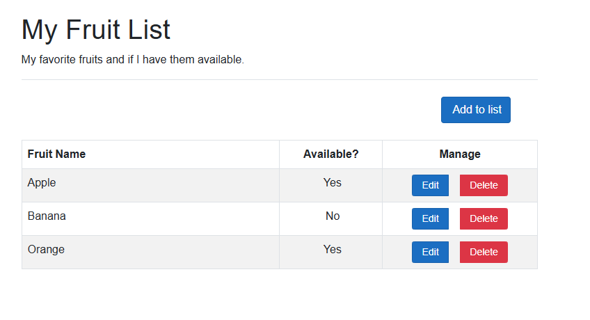

---
lab:
    title: 'Exercise: Implement HTTP operations in ASP.NET Core Blazor Web apps'
    module: 'Module: Implement HTTP operations in ASP.NET Core Blazor Web apps'
---

In this exercise, you learn how to add code to an ASP.NET Core Blazor Web app to create the HTTP client and perform `GET`, `POST`, `PUT`, and `DELETE` operations. This code is added to the *.razor.cs* code-behind files. The code to render the data in the *.razor* files is complete.

## Objectives

After you complete this exercise, you will be able to:

* Implement `IHttpClientFactory` as the HTTP client
* Implement HTTP operations in ASP.NET Blazor Web apps

## Prerequisites

To complete the exercise you need to have the following installed on your system:

* [Visual Studio Code](https://code.visualstudio.com)
* [The latest .NET 8.0 SDK](https://dotnet.microsoft.com/download/dotnet/8.0)
* [The C# extension](https://marketplace.visualstudio.com/items?itemName=ms-dotnettools.csharp) for Visual Studio Code

**Estimated exercise completion time**: 30 minutes

## Exercise scenario

This exercise has two components:

* An app that sends HTTP requests to an API. The web app runs on `http://localhost:5010`.
* An API that responds to HTTP requests. The API runs on `http://localhost:5050`.


## Download the code

In this section you download the code for the Fruit web app and the Fruit API. You also run the Fruit API locally so it is available for the web app.

### Task 1: Download and run the API code

1. Right-click the following link and select the **Save link as** option. 

    * [FruitAPI project code](https://raw.githubusercontent.com/MicrosoftLearning/APL-2002-develop-aspnet-core-consumes-api/master/Allfiles/Downloads/FruitAPI.zip) code

1. Launch **File Explorer** and navigate to the location the file was saved.

1. Unzip the file into it's own folder.

1. Open **Windows Terminal**, or a **Command Prompt**, and navigate to the location you extracted the code for the API.

1. In **Windows Terminal** pane run the following `dotnet` command:

    ```
    dotnet run
    ```

1. Following is an example of the generated output. Note the `Now listening on: http://localhost:5050` line in the output. It identifies the host and port for the API.

    ```
    info: Microsoft.EntityFrameworkCore.Update[30100]
          Saved 3 entities to in-memory store.
    info: Microsoft.Hosting.Lifetime[14]
          Now listening on: http://localhost:5050
    info: Microsoft.Hosting.Lifetime[0]
          Application started. Press Ctrl+C to shut down.
    info: Microsoft.Hosting.Lifetime[0]
          Hosting environment: Development
    info: Microsoft.Hosting.Lifetime[0]
          Content root path: 
          <project location>
    ```

>**Note:** Leave the Fruit API running throughout the rest of the exercise. 

### Task 2: Download and open web app project

1. Right-click the following link and select the **Save link as** option. 

    * [Fruit web app code-behind project code](https://raw.githubusercontent.com/MicrosoftLearning/APL-2002-develop-aspnet-core-consumes-api/master/Allfiles/Downloads/FruitWebApp-codebehind.zip)

1. Launch **File Explorer** and navigate to the location the file was saved.

1. Unzip the file into it's own folder.

1. Launch Visual Studio Code and select **File** and then **Open Folder...** in the menu bar.

1. Navigate to the location where you unzipped the project files and select the *FruitWebApp-codebehind* folder.

1. The project structure in the **Explorer** pane should be similar the following screenshot. If the **Explorer** pane isn't visible, select **View** then select **Explorer** in the menu bar.

    

>**Note:** Take time to review the code in each of the files being edited throughout this exercise. The code is heavily commented and can help you understand the code base.

## Implement code for the HTTP client and HTTP operations

The Fruit web app displays the API sample data on the home page and has add, edit, and delete functionality. You need to add code to implement the HTTP client operations. 

### Task 1: Implement the HTTP client

1. Select the *Program.cs* file in the  **Explorer** pane to open it for editing.

1. Add the following code between the `// Begin HTTP client code` and `// End of HTTP client code` comments.

    ```csharp
    // Add IHttpClientFactory to the container and set the name of the factory
    // to "FruitAPI". The base address for API requests is also set.
    builder.Services.AddHttpClient("FruitAPI", httpClient =>
    {
        httpClient.BaseAddress = new Uri("http://localhost:5050/");
    });
    ```

1. Save the changes to *Program.cs*.

### Task 2: Implement the GET operation

1. Select the *home.razor.cs* file in the  **Explorer** pane to open it for editing. It is located in the `Components/Pages` folder.

1. Add the following code between the `// Begin GET operation code` and `// End GET operation code` comments.

    ```csharp
    protected override async Task OnInitializedAsync()
    {
        // Create the HTTP client using the FruitAPI named factory
        var httpClient = HttpClientFactory.CreateClient("FruitAPI");

        // Perform the GET request and store the response. The parameter
        // in GetAsync specifies the endpoint in the API 
        using HttpResponseMessage response = await httpClient.GetAsync("/fruits");

        // If the request is successful deserialize the results into the data model
        if (response.IsSuccessStatusCode)
        {
            using var contentStream = await response.Content.ReadAsStreamAsync();
            _fruitList = await JsonSerializer.DeserializeAsync<IEnumerable<FruitModel>>(contentStream);
        }
        else
        {
            // If the request is unsuccessful, log the error message
            Console.WriteLine($"Failed to load fruit list. Status code: {response.StatusCode}");
        }
    }
    ```

1. Save the changes to *Home.razor.cs*.

1. Review the code in the *Home.razor.cs* file. Note where the `IHttpClientFactory` is added to the page with dependency injection.

### Task 3: Implement the POST operation

1. Select the *Add.razor.cs* file in the  **Explorer** pane to open it for editing.

1. Add the following code between the `// Begin POST operation code` and `// End POST operation code` comments.

    ```csharp
    private async Task Submit()
    {
        // Serialize the information to be added to the database
        var jsonContent = new StringContent(JsonSerializer.Serialize(_fruitList),
            Encoding.UTF8,
            "application/json");

        // Create the HTTP client using the FruitAPI named factory
        var httpClient = HttpClientFactory.CreateClient("FruitAPI");

        // Execute the POST request and store the response. The response will contain the new record's ID
        using HttpResponseMessage response = await httpClient.PostAsync("/fruits", jsonContent);

        // Check if the operation was successful, and navigate to the home page if it was
        if (response.IsSuccessStatusCode)
        {
            NavigationManager?.NavigateTo("/");
        }
        else
        {
            Console.WriteLine("Failed to add fruit. Status code: {response.StatusCode}");
        }
    }
    ```

1. Save the changes to *Add.razor.cs*, and review the comments in the code.

### Task 4: Implement the PUT operation

1. Select the *Edit.razor.cs* file in the  **Explorer** pane to open it for editing.

1. Add the following code between the `// Begin PUT operation code` and `// End PUT operation code` comments.

    ```csharp
    private async Task Submit()
    {
        // Create the HTTP client using the FruitAPI named factory
        var httpClient = HttpClientFactory.CreateClient("FruitAPI");

        // Store the updated data in a JSON object
        var jsonContent = new StringContent(JsonSerializer.Serialize(_fruitList), 
            Encoding.UTF8, "application/json");

        // Execute the PUT request
        using HttpResponseMessage response = await httpClient.PutAsync($"/fruits/{Id}", jsonContent);

        // If the response is successful, navigate back to the home page 
        if (response.IsSuccessStatusCode)
        {
            NavigationManager?.NavigateTo("/");
        }
        else
        {
            Console.WriteLine("Failed to update fruit with edits. Status code: {response.StatusCode}");
        }
    }
    ```

1. Save the changes to *Edit.razor.cs*, and review the comments in the code.

### Task 5: Implement the DELETE operation

1. Select the *Delete.razor.cs* file in the  **Explorer** pane to open it for editing.

1. Add the following code between the `// Begin DELETE operation code` and `// End DELETE operation code` comments.

    ```csharp
    private async Task Submit()
    {
        // Create the HTTP client using the FruitAPI named factory
        var httpClient = HttpClientFactory.CreateClient("FruitAPI");

        // Execute the DELETE request and store the response
        using HttpResponseMessage response = await httpClient.DeleteAsync("/fruits/" + Id.ToString());

        // Return to the home page 
        if (response.IsSuccessStatusCode)
        {
            NavigationManager?.NavigateTo("/");
        }
        else
        {
            Console.WriteLine("Failed to delete fruit. Status code: {response.StatusCode}");
        }
    }
    ```

1. Save the changes to *Delete.razor.cs*, and review the comments in the code.

## Run and test the web app

### Task 1: Run the web app

1. In the Visual Studio Code top menu select **Run \| Start debugging**, or select **F5**. After the project is finished building a browser window should launch with the web app running and displaying the API sample data as shown in the following screenshot.

    

    >**Note:** You can safely ignore the prompt below if it appears when you run the app.

    

### Task 1: Test the web app

1. Select the **Add to list** button and fill in the generated the form. Then select the **Create** button.

1. Verify that your addition appears at the bottom of the list.

1. Choose an item in the list to edit and select the **Edit** button. 
1. Edit the **Fruit Name** and the **Available?** field, then select **Update**.

1. Verify that your changes appear in the list. 

1. Choose an item in the list to delete and select the **Delete** button.

1. On the Delete page, verify that the item you selected is displayed, and click the **Delete** button.

1. Verify that the item no longer appears in the list.

When you are ready to end the exercise:

* Close the browser, or browser tab, and in Visual Studio Code select **Run \| Stop debugging** or **Shift + F5**. 

* Stop the Fruit API by entering  **Ctrl + C** in the terminal it's running in.

## Review

In this exercise you learned how to:

* Implement `IHttpClientFactory` as the HTTP client
* Implement HTTP operations in ASP.NET Core Blazor code-behind files
