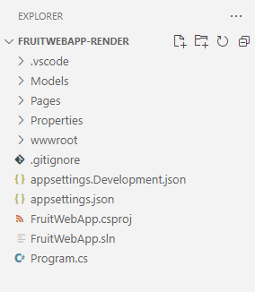

---
lab:
    title: 'Exercise: Render API responses in ASP.NET Core Blazor Web apps'
    module: 'Module: Render API responses in ASP.NET Core Blazor Web apps'
---

In this exercise, you learn how to add code to an ASP.NET Core Blazor Web app to render results from HTTP operations. This code is added to the *.razor* files. The code that performs the operations in the *.razor.cs* files is complete.

## Objectives

After you complete this exercise, you will be able to:

* Implement Razor syntax in an app
* Integrate C# code with Razor syntax

## Prerequisites

To complete the exercise you need to have the following installed on your system:

* [Visual Studio Code](https://code.visualstudio.com)
* [The latest .NET 8.0 SDK](https://dotnet.microsoft.com/download/dotnet/8.0)
* [The C# extension](https://marketplace.visualstudio.com/items?itemName=ms-dotnettools.csharp) for Visual Studio Code

**Estimated exercise completion time**: 30 minutes

## Exercise scenario

This exercise has two components:

* A web app that sends HTTP requests to an API. The app runs on `http://localhost:5010`
* An API that responds to HTTP requests. The API runs on `http://localhost:5050`


## Download the code

In this section you download the code for the Fruit web app and the Fruit API. You also run the Fruit API locally so it is available for the web app.

### Task 1: Download and run the API code

1. Right-click the following link and select the **Save link as** option. 

    * [FruitAPI project code](https://raw.githubusercontent.com/MicrosoftLearning/APL-2002-develop-aspnet-core-consumes-api/master/Allfiles/Downloads/FruitAPI.zip) code

1. Launch **File Explorer** and navigate to the location the file was saved.

1. Unzip the file into it's own folder.

1. Open **Windows Terminal**, or a **Command Prompt**, and navigate to the location you extracted the code for the API.

1. In **Windows Terminal** pane run the following `dotnet` command:

    ```
    dotnet run
    ```

1. Following is an example of the generated output. Note the `Now listening on: http://localhost:5050` line in the output. It identifies the host and port for the API.

    ```
    info: Microsoft.EntityFrameworkCore.Update[30100]
          Saved 3 entities to in-memory store.
    info: Microsoft.Hosting.Lifetime[14]
          Now listening on: http://localhost:5050
    info: Microsoft.Hosting.Lifetime[0]
          Application started. Press Ctrl+C to shut down.
    info: Microsoft.Hosting.Lifetime[0]
          Hosting environment: Development
    info: Microsoft.Hosting.Lifetime[0]
          Content root path: 
          <project location>
    ```

>**Note:** Leave the Fruit API running throughout the rest of the exercise. 

### Task 2: Download and open web app project

1. Right-click the following link and select the **Save link as** option. 

    * [Fruit web app render project code](https://raw.githubusercontent.com/MicrosoftLearning/APL-2002-develop-aspnet-core-consumes-api/master/Allfiles/Downloads/FruitWebApp-render.zip)

1. Launch **File Explorer** and navigate to the location the file was saved.

1. Unzip the file into it's own folder.

1. Launch Visual Studio Code and select **File** and then **Open Folder...** in the menu bar.

1. Navigate to the location where you unzipped the project files and select the *FruitWebApp-render* folder.

1. The project structure in the **Explorer** pane should be similar the following screenshot. If the **Explorer** pane isn't visible, select **View** then select **Explorer** in the menu bar.

    

>**Note:** Take time to review the code in each of the files being edited throughout this exercise. The code is heavily commented and can help you understand the code base.

## Implement code to render data on the Home page

The Fruit web app displays the API sample data on the home page. You need to add code to iterate through the sample data returned by the HTTP `GET` operation performed in the code-behind file.

### Task 1: Add code to render data in a table

1. Select the *Home.razor* file in the  **Explorer** pane to open it for editing.

1. Add the following code between the `@* Begin render API data code block *@` and `@* End render API data code block *@` comments.

    ```razor
    <tbody>
        @*  The Razor explicit expression @foreach is used to iterate through the
            data returned to the data model from the HTTP operations. *@
        @foreach (var obj in _fruitList ?? [])
        {
            <tr>
                @* Display the name of the fruit. *@
                <td width="50%">@obj.name</td>
                @*  The following if statment changes the true/false of instock to Yes/No. *@
                @{
                    if (@obj.instock)
                    {
                        <td width="20%" class="text-md-center">
                            Yes
                        </td>
                    }
                    else
                    {
                        <td width="20%" class="text-md-center">
                            No
                        </td>
                    }
                }
                <td width="30%" class="text-center">
                    @* The following div renders the Edit and Delete buttons that pass the Id 
                        to a function that handles the navigation and passes the Id to the page. *@
                    <div class="w-75 btn-group btn-group-sm" role="group" style="text-align:center">
                        <button class="btn btn-primary  mx-2" @onclick="() => EditButton(obj.id)">
                            Edit
                        </button>
                        <button class="btn btn-danger mx-2" @onclick="() => DeleteButton(obj.id)">
                            Delete
                        </button>
                    </div>
                </td>
            </tr>
        }
    </tbody>
    ```

1. Save the changes to *Home.razor*, and review the comments in the code.

1. In the Visual Studio Code top menu select **Run \| Start debugging**, or select **F5**. After the project is finished building a browser window should launch with the web app running

1. Verify the Index page displays the sample data from the API.

    >**Note:** The **Add to list**, **Edit**, and **Delete** functions will not work until you add code for them later in this exercise.

    >**Note:** You can safely ignore the prompt below if it appears when you run the app.

    

1. To continue with the exercise close the browser, or browser tab, and in Visual Studio Code select **Run \| Stop debugging** or **Shift + F5**.

## Implement code to handle the **Add to list** functionality

The add, edit, and delete operations are each handled on a separate *.razor* page in the project. In this section you add code to create a form in the *Add.razor* file to enable adding data to the list.

### Task 1: Add code to create the add data form

1. Select the *Add.razor* file in the  **Explorer** pane to open it for editing.

1. Add the following code between the `@* Begin render Add code block *@` and `@* End render Add code block *@` comments.

    ```csharp
    @* Data is added using a Razor form, the data model is bound to the form.*@
    <EditForm OnSubmit="Submit" FormName="AddFruit" Model="_fruitList">
    	@* 	The _fruitList.id is here so the full data model is represented on the page.
    		The database behind the API will assign the id. *@
    	<InputNumber hidden="true" @bind-Value="_fruitList!.id" />
    	<div class="border p-3 mt-4" style="width:50%">
    		<div class="row pb-2">
    			<h2 class="text-primary pl-3">Add Fruit</h2>
    			<hr />
    		</div>
    		<div class="mb-3">
    			<label class="h5"></label><br />
    			@* Empty text box for the name of the fruit to be added. *@
    			<InputText @bind-Value="_fruitList!.name" />
    		</div>
    		<div class="mb-3">
    			<label class="h5"></label><br />
    			@* Render the true/false instock state from the record in an editable checkbox. *@
    			<InputCheckbox @bind-Value="_fruitList!.instock" style="width:20px; height:20px" />
    			<label class="h7">Check the box if it's available.</label>
    		</div>
    		@* Submit the addition or return to the Index page if the Add is cancelled.*@
    		<button @onclick="() => Submit()" class="btn btn-primary" style="width:150px;">Create</button>
    		<a class="btn btn-secondary" style="width:150px;" href="/">Cancel</a>
    	</div>
    </EditForm>
    ```
    
1. Save the changes to *Add.razor*, and review the comments in the code.

1. In the Visual Studio Code top menu select **Run \| Start debugging**, or select **F5**. After the project is finished building a browser window should launch with the web app running

1. Select **Add to list** on the page.

1. Enter the name of a fruit you want to add to the list and select the checkbox to indicate it is available.

1. Select **Create** to add the entry to the list and you will be routed back to the home page. Verify your entry was added to the list.

1. To continue with the exercise close the browser, or browser tab, and in Visual Studio Code select **Run \| Stop debugging** or **Shift + F5**.

## Implement code to handle the **Edit** functionality

In this section you add code to create a form in the *Edit.cshtml* file to enable editing data to the list.

### Task 1: Add code for the edit form

1. Select the *Edit.razor* file in the  **Explorer** pane to open it for editing.

1. Add the following code between the `@* Begin render Edit code block *@` and `@* End render Edit code block *@` comments.

    ```csharp
    @* Data is edited using a Razor form, the data model is bound to the form.*@
    <EditForm OnSubmit="Submit" FormName="EditFruit" Model="_fruitList">
    	@* 	The id for the data record is hidden because it needs to be available to the 
    		code-behind processing, but it's not displayed. *@
        <InputNumber hidden="true" @bind-Value="_fruitList!.id" />
    	<div class="border p-3 mt-4" style="width:50%">
    		<div class="row pb-2">
    			<h2 class="text-primary pl-3">Edit Fruit</h2>
    			<hr />
    		</div>
    		<div class="mb-3">
    			<label asp-for="FruitModels.name" class="h5"></label><br/>
    			@* Render the name of the fruit in an editable text box. *@
    			<InputText @bind-Value="_fruitList!.name" />
    		</div>
    		<div class="mb-3">
    			<label  class="h5"></label><br/>
    			@* Render the true/false instock state from the record in an editable checkbox. *@
    			<InputCheckbox @bind-Value="_fruitList!.instock" style="width:20px; height:20px" />
    			<label class="h7"><i class="bi bi-arrow-left"></i>  Check the box if available.</label>
    		</div>
    		@* Submit the changes or return to the Index page if the Edit is cancelled.*@
    		<button type="submit" class="btn btn-danger " style="width:150px;">Save</button>
    		<a class="btn btn-secondary" style="width:150px;" href="/">Cancel</a>
    	</div>
    </EditForm>
    ```

1. Save the changes to *Edit.razor*, and review the comments in the code.

1. In the Visual Studio Code top menu select **Run \| Start debugging**, or select **F5**. After the project is finished building a browser window should launch with the web app running

1. Choose an item in the list to change and select **Edit** in that row.

1. Edit the name of the fruit and select the checkbox to change its availability status.

1. Select **Update** to save your changes and you will be routed back to the home page. Verify your change is shown in the list.

1. To continue with the exercise close the browser, or browser tab, and in Visual Studio Code select **Run \| Stop debugging** or **Shift + F5**.

## Implement code to handle the **Delete** functionality

In this section you add code to create a form in the *Delete.cshtml* file to enable deleting data from the list.

### Task 1: Add code for the delete form

1. Select the *Delete.razor* file in the  **Explorer** pane to open it for editing.

1. Add the following code between the `@* Begin render Delete code block *@` and `@* End render Delete code block *@` comments.

    ```csharp
    @* Data is deleted using a Razor form, the data model is bound to the form.*@
    <EditForm OnSubmit="Submit" FormName="DeleteFruit" Model="_fruitList">
    	@* 	The id for the data record is hidden because it needs to be available to the 
    		code-behind processing, but it's not displayed. *@
        <InputNumber hidden="true" @bind-Value="_fruitList!.id" />
    	<div class="border p-3 mt-4" style="width:50%">
    		<div class="row pb-2">
    			<h2 class="text-primary pl-3">Delete Fruit</h2>
    			<hr />
    		</div>
    		<div class="mb-3">
    			<label asp-for="FruitModels.name" class="h5"></label><br/>
    			@* Render the name of the fruit in a non-editable text box. *@
    			<InputText @bind-Value="_fruitList!.name" Disabled/>
    		</div>
    		<div class="mb-3">
    			<label  class="h5"></label><br/>
    			@* Render the true/false instock state from the record in a non-editable checkbox. *@
    			<InputCheckbox @bind-Value="_fruitList!.instock" style="width:20px; height:20px" Disabled  />
    			<label class="h7">Check the box if available.</label>
    		</div>
    		@* Submit the changes or return to the Index page if the delete is cancelled.*@
    		<button type="submit" class="btn btn-danger " style="width:150px;">Delete</button>
    		<a class="btn btn-secondary" style="width:150px;" href="/">Cancel</a>
    	</div>
    </EditForm>
    ```

1. Save the changes to *Delete.razor*, and review the comments in the code.

1. In the Visual Studio Code top menu select **Run \| Start debugging**, or select **F5**. After the project is finished building a browser window should launch with the web app running

1. Choose an item in the list to delete and select **Delete** in that row.

1. Select **Delete** and you will be routed back to the home page. Verify the item you deleted is no longer shown in the list.

When you are ready to end the exercise:

* Close the browser, or browser tab, and in Visual Studio Code select **Run \| Stop debugging** or **Shift + F5**. 

* Stop the Fruit API by entering  **Ctrl + C** in the terminal it's running in.

## Review

In this exercise you learned how to:

* Implement Razor keywords in an app
* Integrate C# code with Razor Pages syntax
